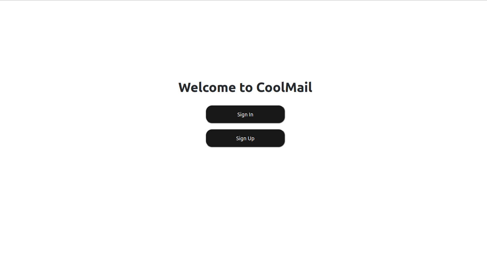
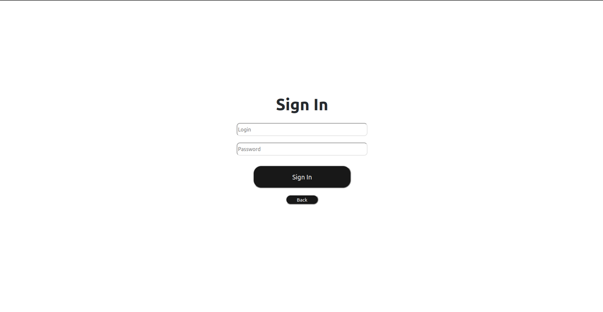
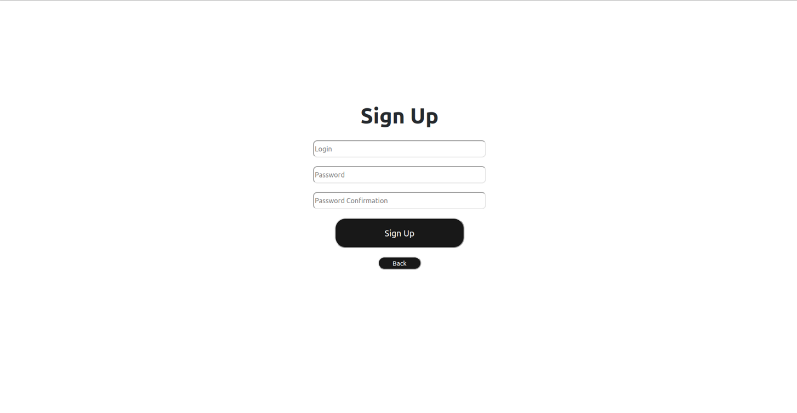
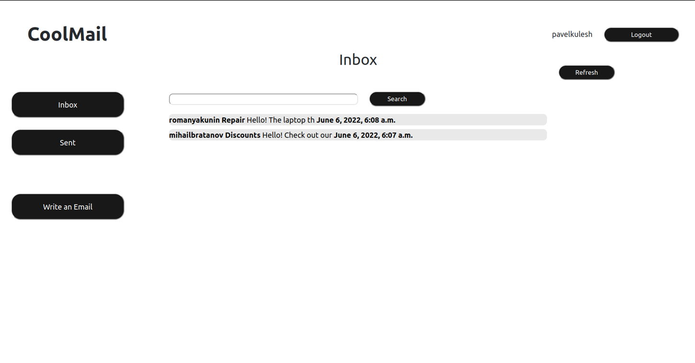
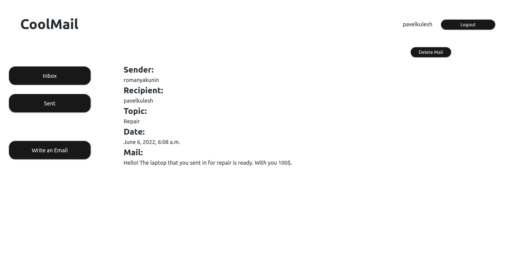
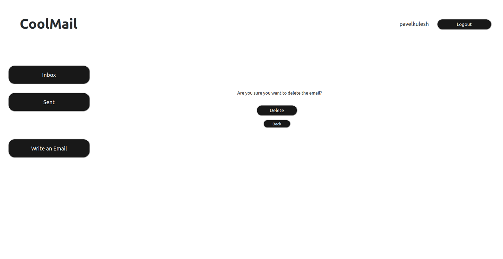
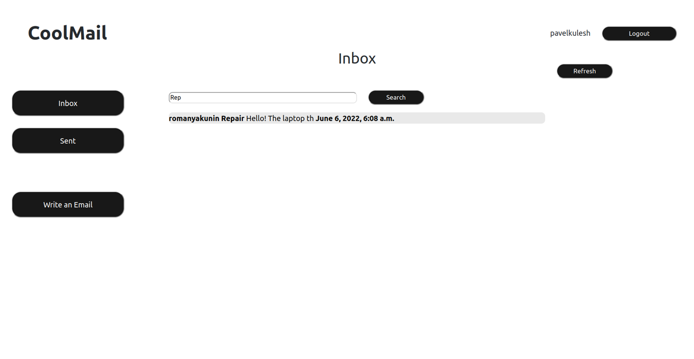
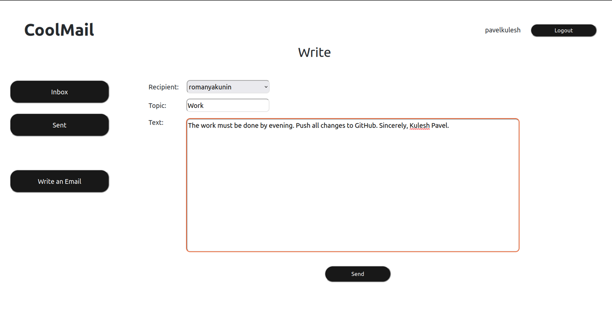

# Email Project

[Email Project](https://coolmailqq.herokuapp.com) is a Python web-site to write and receive emails

## Usage

Страница, на которой оказывается неавторизированный пользователь:

Рисунок 1. Начальная страница

На данной странице пользователь выбирает (авторизация или регистрация)

Страница авторизации:

Рисунок 2. Страница авторизации

После успешной авторизации пользователя перенаправляет на главную страницу почтового ящика (страница входящих писем)

Страница регистрации:

Рисунок 3. Страница регистрации

После успешной регистрации пользователя происходит перенаправляет на главную страницу почтового ящика (страница входящих писем)

Страница входящий писем:

Рисунок 4. Страница входящих писем

Данная страница выступает в роли главной страницы проекта. На ней расположена кнопка Refresh для обновления списка входящих писем. Кнопка Logout позволяет выйти с аккаунта. На данной странице отображаются входящие письма. Есть возможность детального просмотра письма.

Страница детального просмотра письма:

Рисунок 5. Детальный просмотр письма

На данной странице указана вся информация о письме. Также есть функция удаления письма.

Страница подтверждения удаления письма:

Рисунок 6. Страница подтверждения удаления письма

При нажатии на кнопку Delete письмо удаляется. 

Также в проекте реализован поиск письма:

Рисунок 7. Поиск письма

Аналогично реализована папка с отправленными письмами.

Страница написания письма:

Рисунок 8. Написание письма

## Author

pavel-kul1707@mail.ru

P.S. https://hub.docker.com/repository/docker/pavelkulesh/isp2022053503
To run project "docker-compose up"